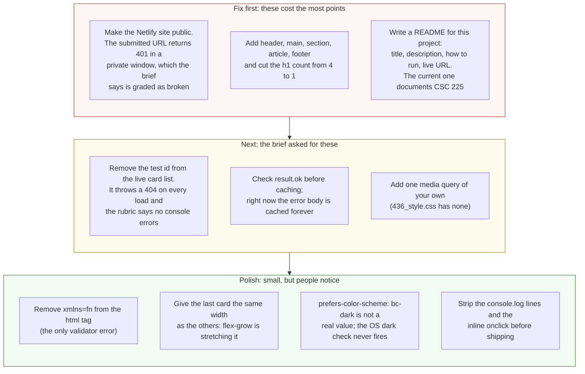

# Project 1: Static Foundations — Feedback

**Student:** Bronson Chow · **Repo:** [BronsonChow/bronsonchow.github.io](https://github.com/BronsonChow/bronsonchow.github.io) · **Submitted page:** `csc436/436_lab1.html`
**Submitted live URL:** [bchow.netlify.app/csc436/436_lab1.html](https://bchow.netlify.app/csc436/436_lab1.html) (private, see below) · **Public copy:** [bronsonchow.github.io/csc436/436_lab1.html](https://bronsonchow.github.io/csc436/436_lab1.html)
**Reviewed at commit:** `3c55fcb` · **Course:** CSC 436, Fall 2026

> **How this review was made.** Your instructor reviewed this project with [Claude](https://claude.com) (Anthropic's AI) as a second set of eyes. Claude cloned the repo, read the submitted page, its stylesheet and script, and the shared nav, footer and settings scripts, loaded the page at phone, tablet and desktop widths, ran the W3C validator, read the console and localStorage, and clicked the theme toggle. Every note and every point below was read and approved by your instructor. Same standard, same rubric, just more time spent looking at *your* code than one human has in a grading week.

> **About the reused repo.** Your instructor approved submitting a page inside your existing personal site. So this review grades the page, its stylesheet and script, and the commits since the project was assigned, not the 160 commits of history before it. The README and live-URL requirements still apply to this project.

## Grade: 65 / 100

| Category | Points | Earned | One line |
|---|:-:|:-:|---|
| Semantic HTML | 20 | 10 | One semantic element on the page (`nav`), four `h1`s, an invalid `xmlns` |
| CSS layout | 25 | 20 | Real Flexbox for the cards, custom properties, a proper dark theme; the last card stretches |
| Responsive design | 15 | 12 | No horizontal scroll, cards wrap 2 / 2 / 3; no media query of your own |
| JavaScript interaction | 15 | 11 | API fetch with localStorage caching is the most ambitious JS in the class; it 404s on every load by design |
| Repository and deployment | 15 | 6 | Submitted URL is private (401); README is for a different course; four commits, all on the due date |
| Content and polish | 10 | 6 | Real cards, real taste, real alt text; two sentences of copy and a deliberate broken entry |
| **Total** | **100** | **65** | **Strong JavaScript instincts on a page that skips the HTML the brief was testing.** |

## The short version

The interesting part of this page is the script. Seven Magic cards pulled from the Scryfall API, cached in localStorage so the second visit is instant, rendered with real card art and the card name as alt text. That's async/await, try/catch, caching, and DOM creation, and it works. Nobody else in the class did a network request.

The rest of the page didn't get the same attention. The HTML is five `div`s. The only semantic element is the `nav`, and it's injected by a script. There are four `h1`s, three of them in the footer. The brief's first requirement, three semantic sections and one `h1`, isn't met. The README documents your CSC 225 project and says nothing about this one. And the URL you submitted returns "This site is private" in a private window. The brief says a broken link at grading time means the project is graded on what can be seen. Your GitHub Pages copy of the same repo is public, which is why there's a grade at all. Fix the Netlify setting before Project 2, or submit the GitHub Pages URL.

## What the numbers looked like

Things Claude measured (so you know these aren't guesses):

| Check | Result |
|---|---|
| Submitted Netlify URL in a private window | HTTP 401, "This site is private. Sign in with an invited Netlify account" |
| Same page on GitHub Pages | HTTP 200, loads normally |
| Horizontal scroll at 375 / 768 / 1280 px | None at any width |
| Cards per row at 375 / 768 / 1280 | 2 / 2 / 3; on phones the last card is twice the width of the others |
| Console on every load | 1 error (404 for card id `test`), 16 `console.log` lines |
| W3C HTML validator | 1 error: `xmlns="fn"` on the `html` element |
| Semantic elements on the page | `nav` only (injected). No `header`, `main`, `section`, `article`, `footer` |
| `h1` elements | 4 (page title plus General, Credit, Contact in the footer) |
| Images | 7 cards from the API, all with alt text, plus the logo |
| `@media` rules in 436_style.css | 0 |
| localStorage after one visit | 8 `cachedCard*` entries, one of which is a cached 404 error body |
| Commits touching csc436/ | 4, all on Sep 15 between 1:35 PM and 10:07 PM |
| README for this project | None. Root README is the CSC 225 API writeup |

---

## Semantic HTML — 10 / 20

**What's working**

- `lang`, viewport, a real `<title>`, a favicon. Every card image gets the card's name as alt text ([436_lab1_script.js L58](https://github.com/BronsonChow/bronsonchow.github.io/blob/3c55fcb/csc436/436_lab1_script.js#L58)), which is exactly right for an image that is the card. The nav is a proper `ul > li > a` with Bootstrap's aria attributes.

**What to change**

- **The page is five `div`s.** [436_lab1.html L25–38](https://github.com/BronsonChow/bronsonchow.github.io/blob/3c55fcb/csc436/436_lab1.html#L25-L38): `div#nav`, `div.hero-div`, `div.para-container`, `div#cardCell`, `div#footer`. The brief asked for at least three distinct content sections using `header`, `nav`, `main`, `section`, `article`, `footer`. The rendered page has one: the `nav` that navbar.js injects. Everything you need is already there as a class; change the tags. `header` around the nav mount, `main` around the content, `section` for the hero and intro, `article` for each card (in `showCard`), `footer` for the footer mount.

  ```mermaid
  flowchart TB
      subgraph now["Now: 436_lab1.html, 42 lines"]
          direction TB
          a1["body"] --> a2["div id=nav<br/>(navbar.js injects a nav here)"]
          a1 --> a3["div.hero-div > <b>h1</b>"]
          a1 --> a4["div.para-container > p, p"]
          a1 --> a5["div id=cardCell .card-container<br/>(script fills it with div.card)"]
          a1 --> a6["div id=footer<br/>(footer.js injects 3 more <b>h1</b>s)"]
          a7["Semantic elements on the page: nav.<br/>h1 count: 4.<br/>header, main, section, article, footer: 0"]
          a1 -.- a7
      end
      subgraph next["What the brief asks for: 3+ semantic sections, one h1"]
          direction TB
          b1["body"] --> b2["<b>header</b> (the injected nav lives here)"]
          b1 --> b3["<b>main</b>"]
          b3 --> b4["<b>section</b>.hero > <b>h1</b> My Favorite MTG Cards"]
          b3 --> b5["<b>section</b>.intro > p, p"]
          b3 --> b6["<b>section</b> id=cardCell > <b>article</b>.card x7"]
          b1 --> b7["<b>footer</b> (h1.credit becomes h2)"]
      end
      now ==>|"same CSS classes, same scripts,<br/>real structure"| next
      style a3 fill:#fff4d6,stroke:#b7791f,color:#111
      style a6 fill:#fde2e2,stroke:#c0392b,color:#111
      style a7 fill:#fde2e2,stroke:#c0392b,color:#111,stroke-dasharray: 5 5
      style b2 fill:#e3f4e1,stroke:#2e7d32,color:#111
      style b3 fill:#e3f4e1,stroke:#2e7d32,color:#111
      style b4 fill:#e3f4e1,stroke:#2e7d32,color:#111
      style b5 fill:#e3f4e1,stroke:#2e7d32,color:#111
      style b6 fill:#e3f4e1,stroke:#2e7d32,color:#111
      style b7 fill:#e3f4e1,stroke:#2e7d32,color:#111
  ```

- **Four `h1`s.** The page title ([L28](https://github.com/BronsonChow/bronsonchow.github.io/blob/3c55fcb/csc436/436_lab1.html#L28)) is correct. Then footer.js adds `<h1 class="credit">` for General, Credit and Contact ([footer.js L48, L55, L59](https://github.com/BronsonChow/bronsonchow.github.io/blob/3c55fcb/footer.js#L48-L59)). Those are `h1` because `h1.credit` has a style rule, not because they're page titles. Make them `h2` (or `p`) and move the style. A page has one `h1`.
- **`xmlns="fn"`** ([L2](https://github.com/BronsonChow/bronsonchow.github.io/blob/3c55fcb/csc436/436_lab1.html#L2)) is the only validator error, and it's on every page in the site. `xmlns` is an XHTML namespace declaration, and "fn" isn't a namespace. Delete the attribute.
- **Six `href="#"` links** in the nav dropdowns. Bootstrap's dropdown pattern, so it's understandable, but `role="button"` on an `<a href="#">` is what a `<button>` is for.

## CSS layout — 20 / 25

**What's working**

- **Flexbox for the card gallery, yours:** `flex-wrap`, centered, with `flex: 1 0 calc(100% / 3)` and a `max-width` cap on each card ([436_style.css L32–44](https://github.com/BronsonChow/bronsonchow.github.io/blob/3c55fcb/csc436/436_style.css#L32-L44)). That's the layout doing real work. Flexbox or Grid satisfies the brief, so no deduction for the missing Grid.
- **Custom properties and a real dark theme.** Six color tokens in `:root`, a `[data-bs-theme="bc-dark"]` block that overrides them with nested rules ([L134–179](https://github.com/BronsonChow/bronsonchow.github.io/blob/3c55fcb/csc436/436_style.css#L134-L179)), and `rgb(from var(--main-color-2) r g b / 50%)` relative color syntax for the translucent surfaces. That's current CSS, used correctly.

**What to change**

- **The last card stretches.** With seven cards and `flex: 1 0 calc(100% / 3)`, the seventh sits alone on its row and `flex-grow: 1` widens it to the `max-width` while the others are narrower. Claude measured 155px for six cards and 320px for the seventh at 375px wide. On tablet and desktop every card hits the 20rem cap, so they match. `flex: 0 0 calc(100% / 3)` (no grow) or `repeat(auto-fit, minmax(…))` on Grid keeps them uniform.
- **`* { font-family }`** ([L1–3](https://github.com/BronsonChow/bronsonchow.github.io/blob/3c55fcb/csc436/436_style.css#L1-L3)) sets the font on every element including icons, which is why Font Awesome needs its own class to win. Put it on `body` and let inheritance work.
- **Bare `transition: 0.2s`** on `body` and `.navbar-brand` ([L21](https://github.com/BronsonChow/bronsonchow.github.io/blob/3c55fcb/csc436/436_style.css#L21), [L129](https://github.com/BronsonChow/bronsonchow.github.io/blob/3c55fcb/csc436/436_style.css#L129)) animates every property. Name the ones you mean.
- `h1 { font-size: 1.5rem }` then `h1.hero-head { font-size: 2rem }` and `h1.credit`: three `h1` styles is a sign the footer headings shouldn't be `h1`.

## Responsive design — 12 / 15

**What's working**

- No horizontal scroll at 375, 768 or 1280. The card row wraps from two to three across. Bootstrap collapses the nav to a hamburger under 992px. The hero and paragraphs are fluid.

**What to change**

- **No media query of your own.** 436_style.css has zero `@media` rules. The wrap is an intrinsic pattern, which the brief accepts, but the phone layout is just the desktop layout squeezed: 137px cards are hard to read. One `@media (max-width: 600px)` that makes cards `flex-basis: 50%` with less margin, or a `min-width` query the other way, would make the phone view deliberate.
- The card container has `gap: 0.1rem` and each card has `margin: 1rem`. One of those is doing all the work. Pick one.

## JavaScript interaction — 11 / 15

**What's working**

- **This is the most ambitious JavaScript in the class.** `fetchCards` ([436_lab1_script.js L13–44](https://github.com/BronsonChow/bronsonchow.github.io/blob/3c55fcb/csc436/436_lab1_script.js#L13-L44)) walks a list of Scryfall ids, checks localStorage first, fetches only what's missing, caches the JSON, and `showCard` builds a `div.card` with the art. async/await, try/catch, a cache layer, and DOM creation, in sixty lines. Second visit loads instantly. Good.
- The theme toggle (shared `userSettings.js` and `navbar.js`) persists to localStorage and swaps the icon. It works; Claude clicked it.

**What to change**

- **The page throws a 404 on every load, on purpose.** The id `test` is in the live card list ([L10](https://github.com/BronsonChow/bronsonchow.github.io/blob/3c55fcb/csc436/436_lab1_script.js#L10)) "for testing error handling." The rubric says "no console errors." Test ids belong in a test, not in production.
- **The error handling doesn't handle the error.** `fetch` does not throw on a 404; it resolves with a response whose `ok` is false. So your `catch` never runs, the 404's JSON body is written to localStorage as `cachedCardtest` and stays there forever, the console logs "Card test cached successfully," and `showCard` silently skips it. The user sees nothing. Check `result.ok` before caching, and tell the user when a card fails.

  ```js
  const result = await fetch(`https://api.scryfall.com/cards/${cardID}`);
  if (!result.ok) throw new Error(`Scryfall returned ${result.status} for ${cardID}`);
  ```

  ```mermaid
  flowchart TB
      subgraph one["On every visit, for the id test"]
          direction LR
          s["fetchCards() runs on page load<br/>for each of 8 ids, including test"] --> c["localStorage has no<br/>cachedCardtest yet"] --> f["fetch scryfall.com/cards/test"] --> r["Scryfall answers <b>404</b><br/>with a JSON error body"] --> k["fetch does <b>not</b> throw on 404.<br/>Your catch block never runs."]
      end
      subgraph two["So this happens, and on later visits the cache skips straight to showCard"]
          direction LR
          w["localStorage.setItem: the error body<br/>is cached as cachedCardtest"] --> sh["showCard: card.object is error,<br/>so nothing renders. No message."] --> con["Console: a red 404 on every visit,<br/>plus 16 console.log lines"] --> fix["Fix: check result.ok before caching,<br/>remove test from the live list,<br/>show the user something on failure"]
      end
      one --> two
      style s fill:#fff4d6,stroke:#b7791f,color:#111
      style r fill:#fde2e2,stroke:#c0392b,color:#111
      style k fill:#fde2e2,stroke:#c0392b,color:#111
      style w fill:#fde2e2,stroke:#c0392b,color:#111
      style con fill:#fde2e2,stroke:#c0392b,color:#111
      style fix fill:#e3f4e1,stroke:#2e7d32,color:#111
  ```

- **The new code has no event listener.** The brief's interaction "must select elements, listen for an event, and change the page." The fetch runs on load. The only event-driven behavior is the pre-existing theme toggle, wired with an inline `onclick="darkMode()"` ([navbar.js L71](https://github.com/BronsonChow/bronsonchow.github.io/blob/3c55fcb/navbar.js#L71)) rather than `addEventListener`. A "Load more" button, a "shuffle" button, or a filter by color would make this page's own script satisfy the requirement.
- **Sixteen `console.log` lines per visit.** Useful while building, noise when shipped. Remove them or gate them behind a debug flag.
- Small, in the shared code: `matchMedia('(prefers-color-scheme: bc-dark)')` ([userSettings.js L5](https://github.com/BronsonChow/bronsonchow.github.io/blob/3c55fcb/userSettings.js#L5)) is not a valid media query, so it's always false and the OS dark-mode check never fires. The real value is `dark`.

## Repository and deployment — 6 / 15

**What's working**

- The four commits touching `csc436/` are real steps: files added, fetch added, CSS reformatted, footer case added. Each commit also updates `verchanges.txt` with a version number, which is a habit most professionals don't have. The messages are specific.

**What to change**

- **The submitted URL is private.** `bchow.netlify.app` returns 401 with "This site is private. Sign in with an invited Netlify account to view it." The brief: "Both links must work in a private or incognito browser window. If a link is broken at grading time, the project is graded on what I can see, which may be nothing." Your GitHub Pages deployment of the same repo is public and identical, which is why this was graded at all. Turn off site protection in Netlify (Site configuration → Access & security), or submit the GitHub Pages URL. Test in a private window before you submit.
- **There is no README for this project.** The root README is the CSC 225 VocaDB API writeup. The brief requires a README with the project title, a description, how to run it locally, and the live URL. None of those exist for this page. A `csc436/README.md` is fine.
- **All four commits are on September 15.** Understandable for a page added to an existing site, but the brief asked for history that shows the project developing over time.

## Content and polish — 6 / 10

**What's working**

- It's real and it's yours: seven cards you own, chosen for the specific printing, with the art pulled live and credited to Scryfall in the footer. The alt text is the card name. The dark theme matches the rest of your site.

**What to change**

- **Two sentences of copy.** The brief asked for real content, and a heading plus two lines is the thinnest text in the class. Why these seven? What deck are they in? One sentence per card, shown under the art from the API's `oracle_text` or your own notes, would turn a grid of images into a page.
- **A broken entry shipped on purpose.** The `test` id is a red line in the console on every visit.
- The lone stretched card at the end of the grid looks like a layout bug, because it is one.

---

## Your next three moves



1. **Make the site public and test the link in a private window.** Five minutes in Netlify settings. This alone was the biggest deduction, and Project 2 has the same rule.
2. **Fix the skeleton and the footer headings.** `header`, `main`, three `section`s, `article` per card, `footer`, one `h1`. Thirty minutes, and it's the first requirement in the brief.
3. **Finish the error handling.** Check `result.ok`, don't cache failures, remove the test id, and show a message when a card fails. Then the most ambitious script in the class is also a correct one.

You can clearly write JavaScript. This project was checking whether you can also write the HTML underneath it. Next time, do both.

*This PR only adds feedback files. It does not touch your code. Merge it, close it, or just read it, your call. Questions go to office hours or the Brightspace board.*
